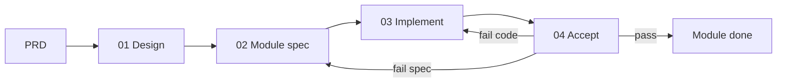

# write-before-code

**[English](README.md)** · **[中文](README.zh-CN.md)**

**Specs on disk first. Code second.**

A multi-agent [Agent Skill](https://agentskills.io) (**Cursor · Codex · Trae · Claude Code**) that stops AI coding from “shipping whatever compiles.”  
You lock behavior in files, agree with a human one slice at a time, then implement — and **the implementer cannot mark the work done.**

| | |
|--|--|
| Type | Opinionated Agent Skill (MIT) — Agent Skills layout |
| Version | 0.3.0 |
| Agents | [Cursor](https://cursor.com) · [Codex](https://developers.openai.com/codex) · [Trae](https://www.trae.ai) · [Claude Code](https://code.claude.com) |
| Docs | [English](content/en/) · [中文](content/zh/) · [Adapters](docs/adapters.md) |

---

## Why it exists

AI agents are fast at producing code and slow at staying honest about intent. Typical failure modes:

- Specs live only in chat, then vanish
- The agent “fixes” failures by quietly drifting from the design
- Tests go green with empty assertions (**fake green**)
- The same agent that wrote the code declares the feature ✅

**write-before-code** treats that as a process bug, not a model bug. It gives you a staged pipeline, disk-backed contracts, and an independent accept stage.

---

## What you get

- **Greenfield:** `01` overall design → `02` module spec → `03` implement → `04` accept  
- **Brownfield:** short incremental task packs under `specs/tasks/`  
- **HITL:** key product calls need maintainer approval  
- **Agree one slice at a time:** confirm a small decision, write it to disk, then continue  
- **No self-pass:** stage `03` may only mark 🔍; only `04` or you may mark ✅  

Not a drop-in replacement for Spec Kit / BMAD / OpenSpec — stricter, more document-heavy, accept-gated.

---

## Who it’s for

- Solo builders or small teams using Cursor / Codex / Trae / Claude Code who want **repeatable** agent runs  
- Greenfield products where architecture and module boundaries still move  
- Brownfield changes where external behavior must stay auditable  

## Who it’s not for

- One-line typo / comment fixes (don’t run the full ceremony)  
- Teams that want the **lightest** possible SDD layer → try OpenSpec  
- Teams that want a **portable multi-agent CLI** first → try Spec Kit  
- Teams that want a **full virtual product org** of personas → try BMAD  

---

## Pipeline at a glance

```text
Greenfield full:  PRD → 01 overall design → 02 module spec → 03 implement → 04 accept
Greenfield lite:  (maintainer explicit; 01 exists; no arch change) → 02 → 03 → 04
Brownfield:       task pack → implement + self-check → maintainer HITL → archive (+ INDEX.md)
```



| Stage | Job |
|-------|-----|
| 00 | Overview / iron laws |
| 01 | overall-design + global-contract + progress |
| 02 | `modules/Fxx-*.md` |
| 03 | Code; progress → 🔍 only |
| 04 | Independent accept → ✅ |

**Iron laws:** write-before-code · HITL · one focus · agree one slice at a time · no self-pass · no fake green.

Details: [SKILL.md](SKILL.md) · [content/en/how-to/agent-prompts/00-overview.md](content/en/how-to/agent-prompts/00-overview.md)

---

## Install

Works on any agent that loads Agent Skills (`SKILL.md`). Full path matrix: [docs/adapters.md](docs/adapters.md).

### One-liner (recommended)

Default installs to **all** supported agents (Cursor, Codex, Trae, Claude Code):

```bash
# macOS / Linux — from a clone of this repo
./scripts/install.sh
./scripts/install.sh --agent codex          # one agent
./scripts/install.sh --agent all --scope project   # commit into a product repo
```

```powershell
# Windows PowerShell — from a clone of this repo
.\scripts\install.ps1
.\scripts\install.ps1 -Agent trae
.\scripts\install.ps1 -Agent all -Scope project
```

| Agent | User install path |
|-------|-------------------|
| Cursor | `~/.cursor/skills/write-before-code/` |
| Codex | `~/.agents/skills/write-before-code/` |
| Trae | `~/.trae/skills/write-before-code/` |
| Claude Code | `~/.claude/skills/write-before-code/` |

Invoke after restart: Cursor/Trae/Claude `/write-before-code`; Codex `$write-before-code`; or just say “use write-before-code”.

### Manual

```text
git clone https://github.com/carlospan/write-before-code.git
# copy/symlink into the agent path from the table above
```

`SKILL.md` must sit at the skill folder root (no extra nesting).

### Project skill (team / one repo)

```bash
./scripts/install.sh --agent all --scope project
```

Typical layout:

```text
<repo>/.cursor/skills/write-before-code/   # Cursor
<repo>/.agents/skills/write-before-code/   # Codex (+ shared convention)
<repo>/.trae/skills/write-before-code/     # Trae
<repo>/.claude/skills/write-before-code/   # Claude Code
```

### Project docs template

Copy **one** language tree into the product’s `docs/`:

| Language | Copy from |
|----------|-----------|
| English | `content/en/` → `docs/` |
| 中文 | `content/zh/` → `docs/` |

### Brownfield attachment filenames

| Role | English docs | Chinese docs |
|------|--------------|--------------|
| Design | `*-design.md` | `*-方案.md` |
| Receipt | `*-receipt.md` | `*-回执.md` |
| Acceptance | `*-acceptance.md` | `*-验收记录.md` |

Do not mix suffixes inside one project docs tree.

---

## Quick start

1. Install the skill for your agent(s) (above).
2. Copy `content/en/` (or `content/zh/`) into the product as `docs/`.
3. Fill `docs/explanation/PRD.md` with **real** requirements (empty skeletons do not count).
4. In your agent:

```text
Use write-before-code. Start at stage 01.
```

5. Per module: `02` → `03` → **open a new chat / session** for `04` accept.
6. After modules are ✅, ship behavior changes via brownfield `specs/tasks/` (see SDD-GUIDE).

Toy PRD: [examples/toy-prd.md](examples/toy-prd.md) · [中文](examples/toy-prd.zh-CN.md)

---

## Compared to peers

| | write-before-code | Spec Kit | BMAD | OpenSpec |
|--|-------------------|----------|------|----------|
| Focus | Disk-first stages + hard accept | Portable specify→implement | Multi-persona planning | Brownfield deltas |
| Self-mark ✅ | Forbidden for implementer | Usually weak | Review skill | Maintainer discipline |
| Docs | Diátaxis + contract/progress | Spec/plan/tasks | Many agent artifacts | Change proposals |

---

## Layout

```text
write-before-code/
├── SKILL.md              # Agent entry (Agent Skills standard)
├── skill.json            # Version / compatibleAgents
├── README.md             # English (this file)
├── README.zh-CN.md       # Chinese
├── docs/adapters.md      # Per-agent install matrix
├── CONTRIBUTING.md
├── scripts/              # multi-agent install + parity check
├── examples/
├── content/
│   ├── en/               # Full English corpus
│   └── zh/               # Full Chinese corpus
└── .github/              # CI + issue templates
```

---

## Contributing

See [CONTRIBUTING.md](CONTRIBUTING.md). Process PRs must update **both** `content/en/` and `content/zh/`.

```bash
python scripts/check-parity.py
```

---

## License

MIT — see [LICENSE](LICENSE).
