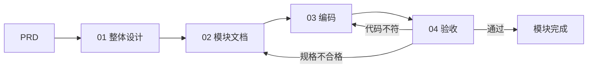

# write-before-code

**[English](README.md)** · **[中文](README.zh-CN.md)**

**先落盘规格，再写代码。**

面向多 Agent 的 [Agent Skill](https://agentskills.io)（**Cursor · Codex · Trae · Claude Code**）：不让 AI「能跑就算交付」。  
先把行为写进文件、和人一块一拍对齐，再编码——**写代码的那一方不能自己标完成。**

| | |
|--|--|
| 形态 | 有主见的 Agent Skill（MIT）— Agent Skills 布局 |
| 版本 | 0.3.0 |
| 支持的 Agent | [Cursor](https://cursor.com) · [Codex](https://developers.openai.com/codex) · [Trae](https://www.trae.ai) · [Claude Code](https://code.claude.com) |
| 文档 | [English](content/en/) · [中文](content/zh/) · [适配说明](docs/adapters.zh-CN.md) |

---

## 它解决什么问题

Agent 写代码很快，但对齐意图很容易偷懒。常见翻车：

- 规格只活在聊天里，一关对话就丢  
- 为了修红，悄悄偏离设计  
- 测试假绿（空断言、没真跑）  
- **写代码的同一个 Agent 给自己点 ✅**

**write-before-code** 把这当成流程事故，而不是「模型不够聪明」。它提供分阶段流水线、落盘契约，以及**独立验收**。

---

## 你能得到什么

- **绿场：** `01` 整体设计 → `02` 模块文档 → `03` 编码 → `04` 验收  
- **棕地：** `specs/tasks/` 里的短增量任务包  
- **HITL：** 关键产品决策须维护者点头  
- **一块一拍：** 谈定一小块就立刻落盘，再往下走  
- **禁自标通过：** `03` 只能标 🔍；✅ 仅 `04` 或你本人  

不是 Spec Kit / BMAD / OpenSpec 的即插即用替代品——更偏文档与门控，验收更硬。

---

## 适合谁

- 用 Cursor / Codex / Trae / Claude Code、想要**可重复** Agent 流程的独立开发者或小团队  
- 架构与模块边界还在变的绿场产品  
- 需要对外行为可审计的棕地改动  

## 不适合谁

- 改错字、改注释这类琐事（不必走满仪式）  
- 想要**最薄**一层 SDD → 更看 OpenSpec  
- 想要**多 Agent、可移植 CLI** 优先 → 更看 Spec Kit  
- 想要**一整支虚拟产品团队人设** → 更看 BMAD  

---

## 流水线一览

```text
绿场满配：  PRD → 01 整体设计 → 02 模块文档 → 03 编码 → 04 验收
绿场轻量：  （维护者明示；01 已在；不改架构）→ 02 → 03 → 04
棕地：      任务包 → 编码自验 → 维护者 HITL → 归档（须 INDEX.md）
```



| 阶段 | 职责 |
|------|------|
| 00 | 总纲 / 铁律 |
| 01 | overall-design + global-contract + progress |
| 02 | `modules/Fxx-*.md` |
| 03 | 编码；progress 只标 🔍 |
| 04 | 独立验收 → ✅ |

**铁律：** 先写后码 · 人在回路 · 一次一个焦点 · 一块一拍 · 禁自标 ✅ · 假绿无效。

详情：[SKILL.md](SKILL.md) · [content/zh/how-to/agent-prompts/00-overview.md](content/zh/how-to/agent-prompts/00-overview.md)

---

## 安装

凡能加载 Agent Skills（`SKILL.md`）的 Agent 均可。完整路径表：[docs/adapters.zh-CN.md](docs/adapters.zh-CN.md)。

### 一键安装（推荐）

默认装到**全部**已支持 Agent（Cursor、Codex、Trae、Claude Code）：

```bash
# macOS / Linux — 在本仓库克隆目录内
./scripts/install.sh
./scripts/install.sh --agent codex
./scripts/install.sh --agent all --scope project
```

```powershell
# Windows PowerShell — 在本仓库克隆目录内
.\scripts\install.ps1
.\scripts\install.ps1 -Agent trae
.\scripts\install.ps1 -Agent all -Scope project
```

| Agent | 用户级安装路径 |
|-------|----------------|
| Cursor | `~/.cursor/skills/write-before-code/` |
| Codex | `~/.agents/skills/write-before-code/` |
| Trae | `~/.trae/skills/write-before-code/` |
| Claude Code | `~/.claude/skills/write-before-code/` |

重启后调用：Cursor/Trae/Claude `/write-before-code`；Codex `$write-before-code`；或直接说「用 write-before-code」。

### 手动

```text
git clone https://github.com/carlospan/write-before-code.git
# 按上表复制/链接到对应 Agent 路径
```

Skill 目录根下必须有 `SKILL.md`（不要多套一层目录）。

### 项目级 Skill（团队 / 单仓）

```bash
./scripts/install.sh --agent all --scope project
```

常见布局：

```text
<仓库>/.cursor/skills/write-before-code/   # Cursor
<仓库>/.agents/skills/write-before-code/   # Codex（及共享约定）
<仓库>/.trae/skills/write-before-code/     # Trae
<仓库>/.claude/skills/write-before-code/   # Claude Code
```

### 项目文档模板

把**一种**语言的文档树复制到产品仓库的 `docs/`：

| 语言 | 复制来源 |
|------|----------|
| 中文 | `content/zh/` → `docs/` |
| English | `content/en/` → `docs/` |

### 棕地附件文件名

| 角色 | 英文文档树 | 中文文档树 |
|------|------------|------------|
| 方案 | `*-design.md` | `*-方案.md` |
| 回执 | `*-receipt.md` | `*-回执.md` |
| 验收记录 | `*-acceptance.md` | `*-验收记录.md` |

同一项目文档树内不要混用后缀。

---

## 快速开始

1. 按上文为你的 Agent 安装 Skill。  
2. 将 `content/zh/`（或 `content/en/`）复制为产品仓库的 `docs/`。  
3. 在 `docs/explanation/PRD.md` 写入**真实**需求（空骨架不算）。  
4. 在 Agent 中说：

```text
用 write-before-code，从 01 开始。
```

5. 每个模块：`02` → `03` → **新开对话/会话**做 `04` 验收。  
6. 模块均为 ✅ 之后，行为变更走棕地 `specs/tasks/`（见 SDD-GUIDE）。

玩具 PRD：[examples/toy-prd.zh-CN.md](examples/toy-prd.zh-CN.md) · [English](examples/toy-prd.md)

---

## 和同行对比

| | write-before-code | Spec Kit | BMAD | OpenSpec |
|--|-------------------|----------|------|----------|
| 重心 | 落盘分阶段 + 硬验收 | 便携 specify→implement | 多角色规划 | 棕地增量 |
| 自标 ✅ | 实现方禁止 | 通常较弱 | 有 review | 靠维护者纪律 |
| 文档 | Diátaxis + 契约/进度 | Spec/plan/tasks | 大量 Agent 产物 | 变更提案 |

---

## 目录结构

```text
write-before-code/
├── SKILL.md              # Agent 入口（Agent Skills 标准）
├── skill.json            # 版本 / compatibleAgents
├── README.md             # 英文
├── README.zh-CN.md       # 中文（本文件）
├── docs/adapters.zh-CN.md
├── CONTRIBUTING.md
├── scripts/              # 多 Agent 安装 + 语料对齐检查
├── examples/
├── content/
│   ├── en/
│   └── zh/
└── .github/              # CI + Issue 模板
```

---

## 贡献

见 [CONTRIBUTING.zh-CN.md](CONTRIBUTING.zh-CN.md)。涉及流程的 PR 必须同时改 `content/en/` 与 `content/zh/`。

```bash
python scripts/check-parity.py
```

---

## 许可证

MIT — 见 [LICENSE](LICENSE)。
